# x) Tiivistä
## Hoikkala 2023: [ffuf README.md](https://github.com/ffuf/ffuf/blob/master/README.md")

- ffuf on lyhenne "Fuzz Faster U Fool" ja se on tehokas web-fuzzeri, joka on kirjoitettu Go ohjelmointikielellä.
- Tämä työkalua käytetään esim. hakemistojen etsimiseen, virtual hostin löytöihin, parametrien fuzzaukseen ja POST-datan fuzzaukseen.
- Web fuzzer on työkalu, jolla lähetetään automaattisesti suuri määrä eriliaisia inputteja verkkosovellukseen, että voi tarkistaa miten se reagoi.
- Asennus onnistuu monella eri tavalla. Esim. Homebrewlla tai go install -komennolla.
- README esittelee myös muutamia käyttöesimerkkejä, kuten recursive-scanin ja timeout-rajojen käytön.

## Karvinen 2023: [Find Hidden Web Directories - Fuzz URLs with ffuf](https://terokarvinen.com/2023/fuzz-urls-find-hidden-directories/)

- Artikkelissa selitetään, miten fuzzing-tekniikalla etsitään piilotettuja sivuja käyttämällä ffuf-työkalua, wordlistejä ja tulosten suodatusta.
- Web-sovelluksissa voi olla piilotettuja hakemistoja, joita ei näy suoraan käyttäjälle.
- ffuf automatisoi näiden löytämisen testaamalla URL-polkuja wordlistin avulla.
- Fuzzing toimii korvaamalla `FUZZ`-kohtaa eri sanoilla (esim.admin, test).
- Tuloksia yleensä pitää suodattaa (esim. respose size), jotta oikeat löydöt erottuvat.
- Löydetyt endpointit varmistetaan selaimessa tai curlilla.

# a) Fuzzzz. Ratkaise dirfuz-1 artikkelista Karvinen 2023: [Find Hidden Web Directories - Fuzz URLs with ffuf.](https://terokarvinen.com/2023/fuzz-urls-find-hidden-directories/)

Käynnistetään ekana Kali virtuaalikone. Avataan terokarvinen.com ja valitaan sieltä ylänavigoinnissa oleva "Courses" ja sieltä Tunkeutumistestaus. Sitten Scrollaa kunnes löydät h5 Fuzzy kohta ja sieltä klikkaa Find Hidden Web Directories hyperlinkki ja klikkaa se.

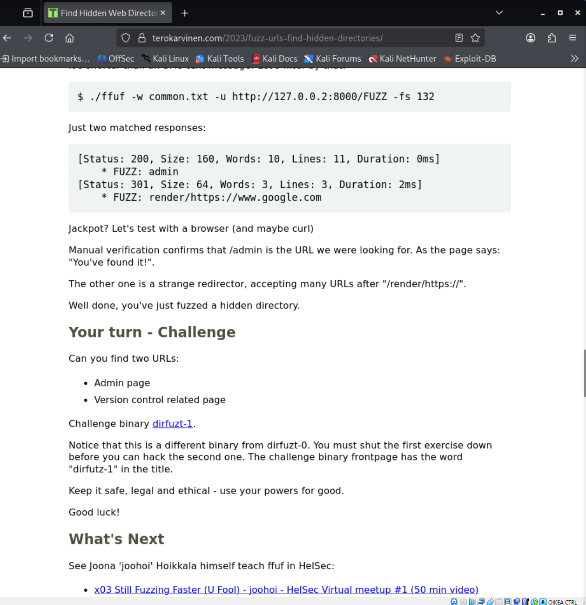

Scrollaan niin pitkä, kunnes löydät tuon firfuzt-1 linkki ja klikkaa se ja sitten tiedosto latautuu.

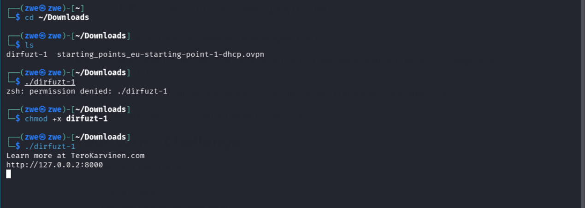

Tämän jälkeen mennään terminaali kirjoittamaan ja mennään nyt siihen kansioon, missä tiedosto on ladattu. Ytiyin avata, mutta sain error ja pääsy on estetty niin annan itselle pääsyoikeus käyttämällä ´chmod +x´ komennon avulla. Sitten avasin tiedosto ja tuli osoite "http_//127.0.0.2:8000".

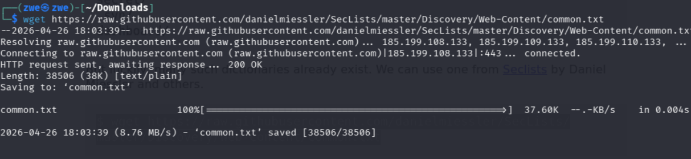

Nyt käynnistyin terokarvisen sivun ohjeen mukaan `wget https://raw.githubusercontent.com/danielmiessler/SecLists/master/Discovery/Web-Content/common.txt` ja sain wordlist tallennettu koneeseen. Wordlistin avulla löytää hidden directories ja se kokeilee ja käy läpi todella monet sanat automaattisesti.

Nyt ajetaan ffuf terminaalissa käyttämällä komento `ffuf -w common.txt -u http://127.0.0.1:8000/FUZZ`. 

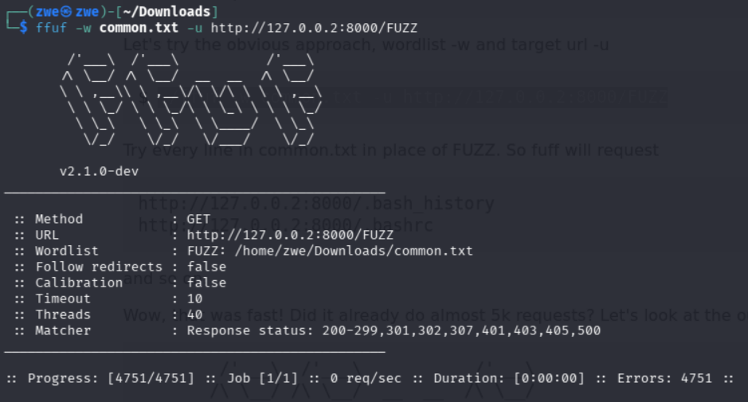

Tuli error ja sen syynä oli dirfuzt-1 käynnistää web-palvelimen ja itse lähdin sieltä ja tritin käynnistää se ffuf komento. Se johti error ja sen sain hoidettu niin, että käynnistän toinen terminaali ja kirjoitin siellä komento `ffuf -w common.txt -u http://127.0.0.1:8000/FUZZ`. 

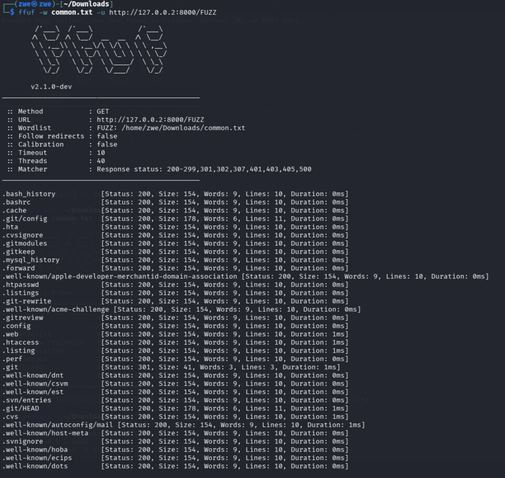

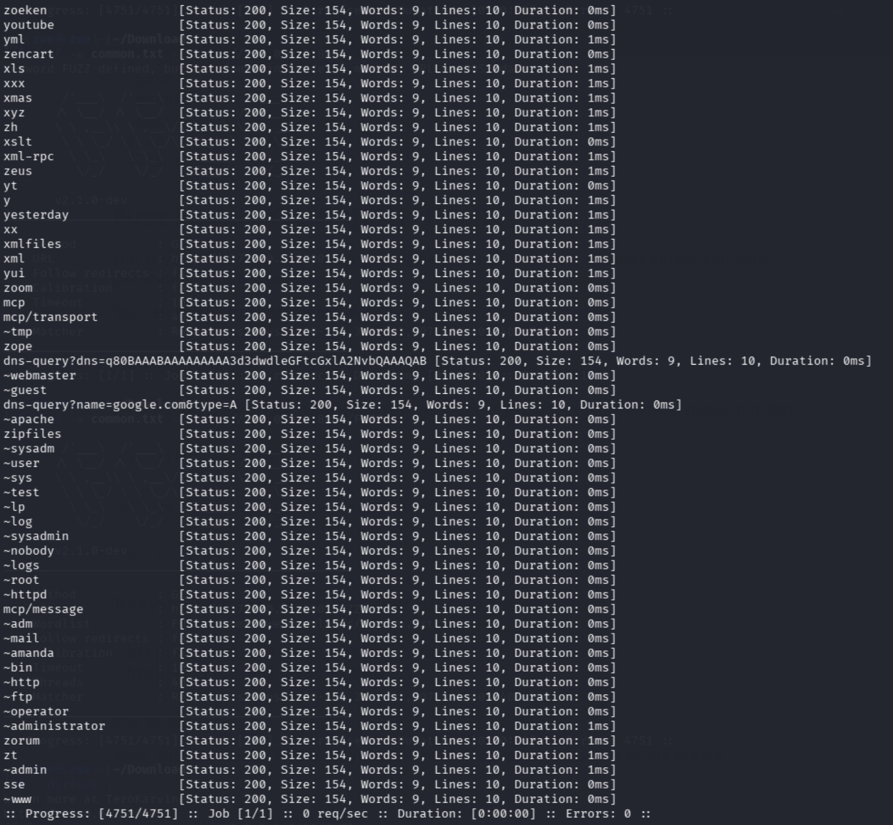

Nyt sain kunnon kasa vastaus ja filteröidään vastauksesta turhat pois. Siihen käytin `ffuf -w common.txt -u http://127.0.0.1:8000/FUZZ -fs 154`, koska size 154 toistui todella usein. ja sen lopputulos on: 

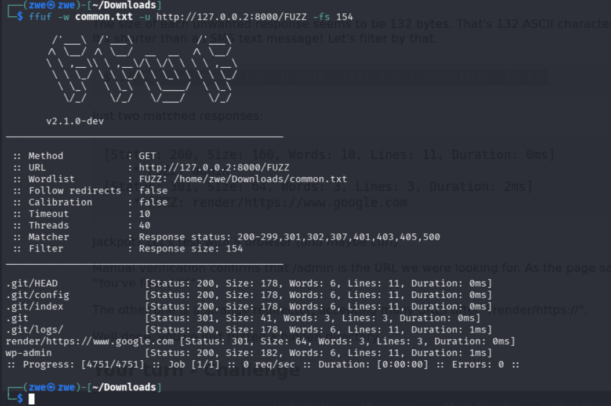

Näistä poimin kiinnostava tulokset ja valitsin .git ja wp-admin. Seuraavaksi tarkistin mitä löytyy selaimessa "http://127.0.0.2:8000/wp-admin" ja "http://127.0.0.2:8000/.git", niin sain seuraavalainen tulokset:

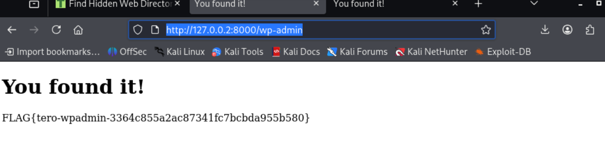

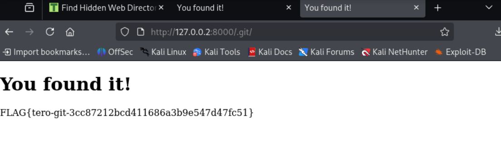

Eli sain FLAG ja onnistuin! wp-admin flag on FLAG{tero-wpadmin-3364c855a2ac87341fc7bcbda955b580} ja .git admin on  FLAG{tero-git-3cc87212bcd411686a3b9e547d47fc51}

# b) Fuff me. Asenna FuffMe-harjoitusmaali. Karvinen 2023: [Fuffme - Install Web Fuzzing Target on Debian](https://terokarvinen.com/2023/fuffme-web-fuzzing-target-debian/)

Nyt asennetaan virtuaalikoneseen FuffMe-harjoitusmalli. Ajan seuraava komenntot terminaalissa:

`sudo apt-get update`

`sudo apt-get install docker.io git ffuf`

`git clone https://github.com/adamtlangley/ffufme`

`cd ffufme/`

`sudo docker build -t ffufme .`

`sudo docker run -d -p 80:80 ffufme`

`curl localhost`

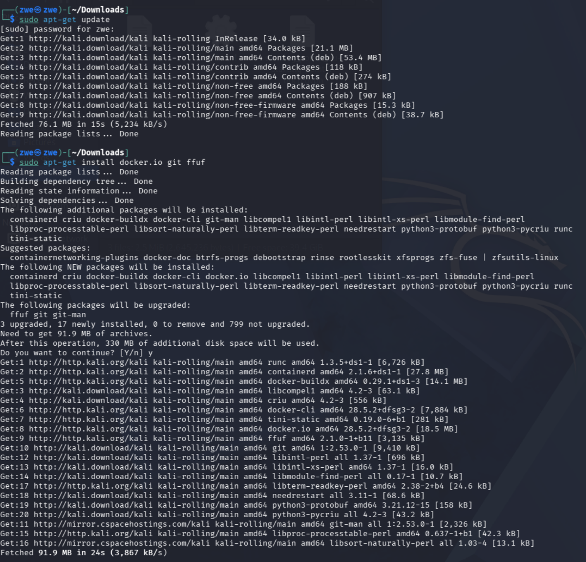

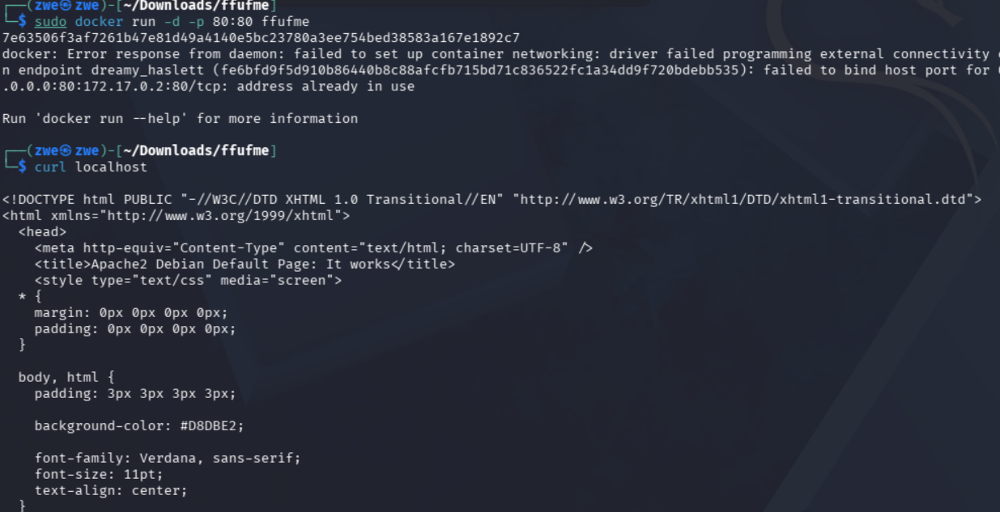

Tässä tuli error, että portti 80 on varattu, koska siinä apache on päällä. Tämä tarkoittaa sitä, että sama portti ei voi olla kahdella palvelulla käytössä samaan 
aikaan. 

Ratkaisin tämän sammuttamalla Apchen komennolla:
`sudo systemctl stop apache2`

Tämän jälkeen käynnistin FuffMe uudelleen komennolla:
`sudo docker run -d -p 80:80 ffufme`

Tässä `-d` ajaa kontin taustalla eli detached mode ja 
`-p 80:80` yhdistää oman koneen portin 80 konttiin porttin 80. 

 Sitten tarkistin, että palvelu toimii:

 `curl localhost`.

Tämä palautti HTML-sivun, eli kaikki toimii oikein.

# c) Ratkaise ffufme harjoitukset - kaikki paitsi ei "Content Discovery - Pipes". Basic Content Discovery

Menin takasiin kansiotasossa yhdellä tasolla ylöspäin komennolla:

`cd ..` 

Tämän jälkeen suoritin ffuf-komennon:

 `ffuf -w common.txt -u http://localhost/cd/basic/FUZZ`

 Tässä on:

 `-w common.txt` = wordlist, eli lista sanoistajoita testataan (esim. admin, test, jne.)

 `-u` = kohde URL

 `FUZZ` = kohta, johon ffuf sijoittaa jokaisen sanaan wordlistasta

 Eli käytännössä ffuf tekee pyyntöjä kuten:

 `http://localhost/cd/basic/admin`
 `http://localhost/cd/basic/test`
 `http://localhost/cd/basic/class`

 ja katsoo, mitkä niistä palauttavat oikean vastauksen.

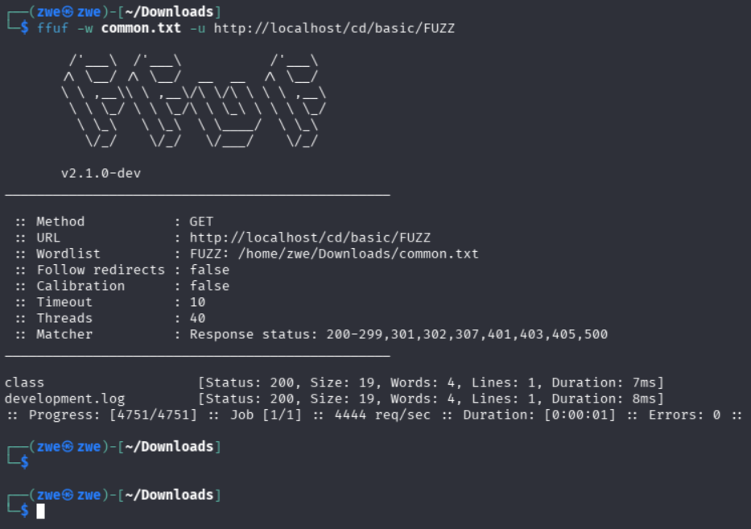

Tuloksena sain:

`class` ja `development.log`

Nämä tarkoittavat, että kyseiset polut ovat olemassa palvelimella.

Seuraavaksi tarkistin ne selaimessa:

- "http://localhost/cd/basic/class"
- "http://localhost/cd/basic/development.log".

Kuvat ovat: 

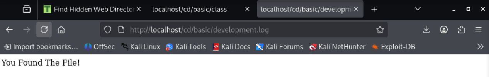

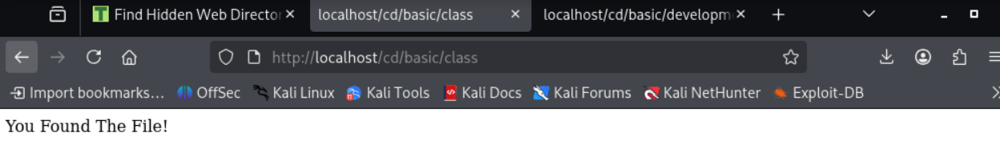

Ja sivut aukesivat, joten tiedän etta fuzzaus onnistui oikein.

# d) Content Discovery With Recursion

Nyt tässä käytetään recursionia. Komento on:

`ffuf -w /common.txt -u http://localhost/cd/recursion/FUZZ -recursion`

Tässä:

- `-w common.txt` tarkoittaa wordlistia, josta ffuf ottaa sanat testaukseen
- `-u http://localhost/cd/recursion/FUZZ` on kohdeosoite, jossa `FUZZ` korvataan wordlistin sanoilla
- `-recursion` tarkoittaa sitä, että ffuf ei tsi vain ensimmäiseltä tasolta, vaan menee myös löydettyjen kansioiden sisään ja jatkaa etsimistä sieltä

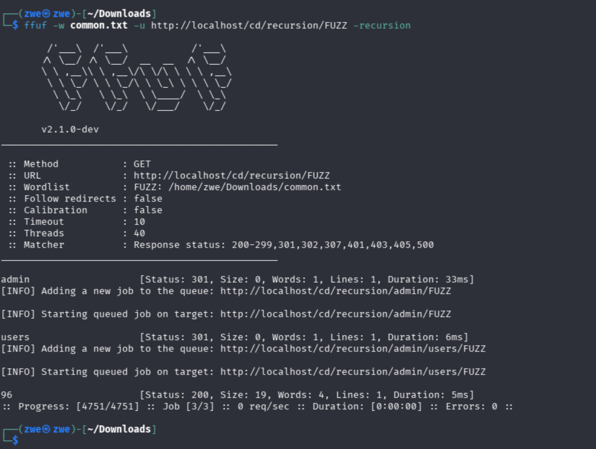

tässä tuloksessa näkyy esimerkiksi: 

- [INFO] Adding a new job...
- [INFO] Starting queued job...

Tämä kertoo siitä, että recursion toimii oikein ja ffuf menee kansioiden sisään automaattisesti jatkamaan hakua.

Tuloksissa näkyi myös `96`, joka oli löytö. Sen jälkeen testasin selaimessa osoitetta:

"http://localhost/cd/recursion/admin/users/96".

 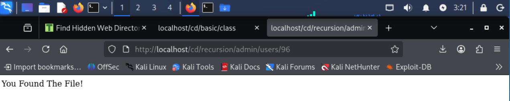

 Löysin oikea endpoint. Onnistuin löytämään hakemistosta piilotetun polun ja löysin mielestäni oikealla tavalla.

# e) Content Discovery With File Extensions

Nyt katsotaan file extensions eli tiedostopäätteet, kuten. `.txt`, `.php` tai `.log`. Tässä ideana on, että ffuf testaa saman sanan eri tiedostopäätteillä. 

Elisjos wordlistissa on esimerkiksi `admin`, ffuf kokeilee:

`admin.php`
`admin.txt`
`admin.log`

Käytin komentona:

 `ffuf -w ~/Downloads/common.txt -u http://localhost/cd/ext/FUZZ -e .php,.txt,.log`.

Tässä:
- `-w` = wordlist
- `-u` = kohde URL
- `FUZZ` = kohta johon sanat menee
- `-e` = extensions eli tiedostopäätteet mitä testataan

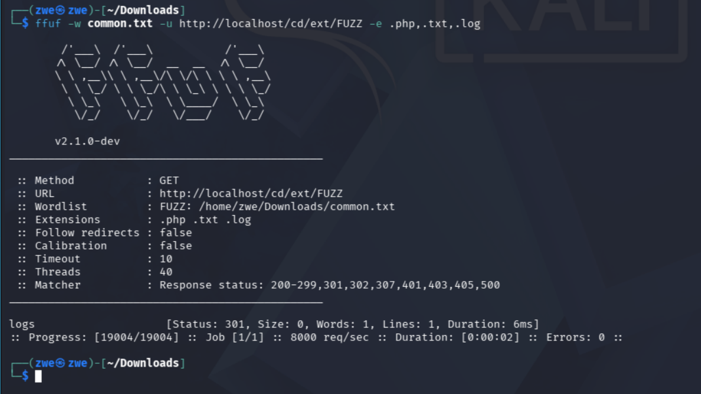

Tässä vaiheessa en löytänyt suoraan varsinaista tiedostoa, mutta löytyi `/logs `kansio. Tämä on hyvä vihje, koska se kertoo että siellä voi olla jotain lisää piilossa.

Seuraavaksi hyödynsin tätä tietoa ja jatkoin etsimistä kyseisen kansion sisältä. 

Käytän komentona:

 `ffuf -w ~/Downloads/common.txt -u http://localhost/cd/ext/logs/FUZZ -e .php,.txt,.log` 
 
 Eli sama idea kuin äsken, mutta nyt kohde on:

 `/cd/ext/logs/`

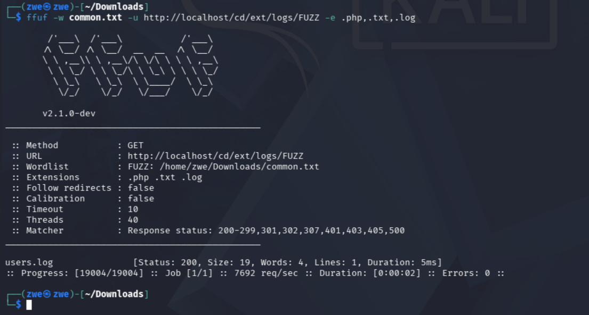

Eli nyt etsimistä onnistui hyvin! ja seuraavaksi testasin sen selaimessa. 

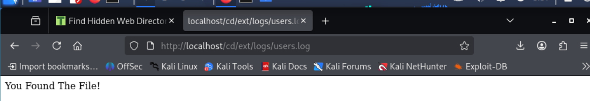

Sivussa näkyy "You Found The File!" eli löysin oikea endpoint!

# f) No 404 Status

Tässä katsotaan no404 tehtävä. Tässä ideana onm että palvelin ei palauta 404-virhettä, vaikka sivua ei ole olemassa. Eli kaikki näyttää "onnistuneelta", vaikka ei oikeasti ole.

Alotin komennolla:

`ffuf -w ~/Downloads/common.txt -u http://localhost/cd/no404/FUZZ`

Tässä:
- `-w` = wordlist
- `-u` = kohde URL
- `FUZZ` = kohta johon sanat menee

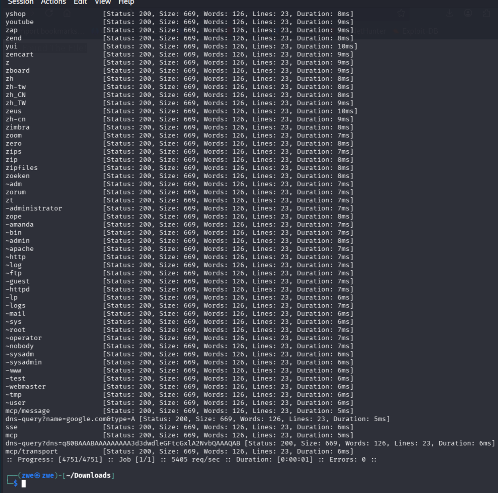

Suorituksen jälkeen tuli pitkä lista tuloksia. Tämä johtuu siitä, että serveri palauttaa kaikille pyynnölle saman statuskoodin (ei 404), joten kaikki näyttää validilta.

Huomasin, että suurin osa vastauksista oli saman kokoisia (feikki vastauksia). Siksi suodatin ne pois käyttämällä `-fs`(filter size).

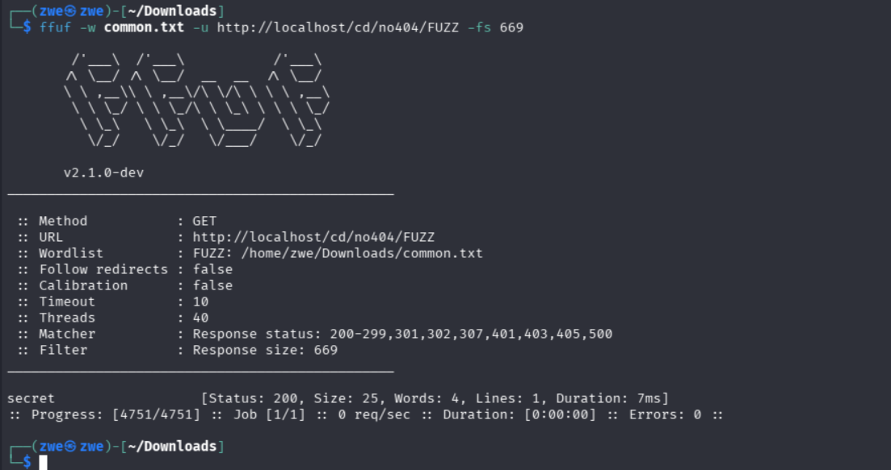

Kun suodatin toistuvan koon pois, jäljelle jäi oikea löytö ja se on `secret`

Avasin selaimessa: "http://localhost/cd/no404/secret"

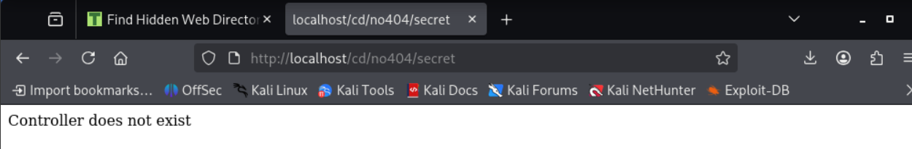

Selaimessa näkyy "Controller does not exist" ja vaikka viesti näyttää virheeltä, tämä on tässä tehtävässä oikea tulos. Koska:
- serveri ei käytä 404-statuskoodia
- se vaan palautttaa aina saman tyyppisen vastauksen
- oikea endpoint löytyy response sizen avulla

# g) Param Mining

Seuraavaksi mennään Param Miningiin. Tässä etsitään GET-parametrin nimi, ei arvoa.

Eka testatan toimiiko selaimessa "http://localhost/cd/param/data". 

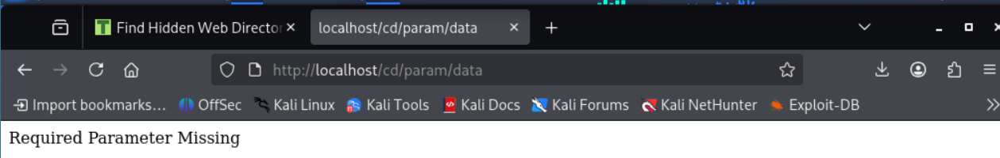

Sivu näyttää "Required Parameter Missing"

eli palvelin sanoo, että parametri puuttuu. Tämä tarkoittaa, että:
-  parametri on olemassa
- mutta sen nimi pitää löytää

Ennen kuin aloitan, latasin `parameters.txt`, joka sisältää yleisiä parametrien nimiä.

käytin komento `wget http://ffuf.me/wordlist/parameters.txt` saadaksen sen txt tiedosto.

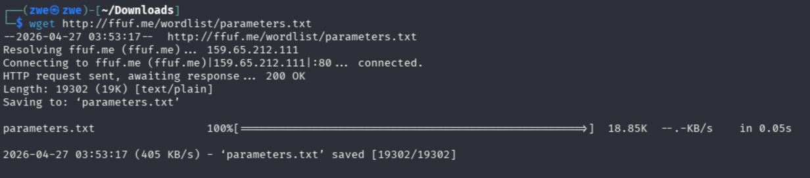

Nyt on ladattu, joten seuraavaksi ajoin:

 `ffuf -w ~/wordlists/parameters.txt -u http://localhost/cd/param/data?FUZZ=test`

 Tässä:
 - `-w` = wordlist(parametrin nimet)
 - `FUZZ` = koravataan parametrin nimellä
 - `?FUZZ=test` = testataan eri parametreja URL:issa

 Eli ffuf kokeilee esimerkiksi:

 `?id=test`
 `?user=test`
 `?debug=test`

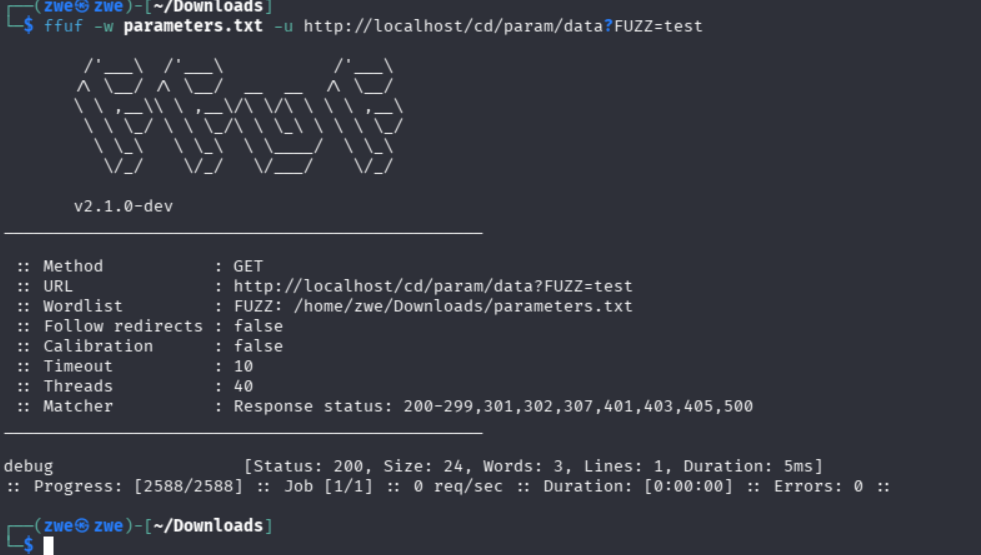

Täällä kertaa löytyi 

`debug`

Tämä tarkoittaa, että `debug` on oikea parametrin nimi.

Testasin selaimessa:

`http://localhost/cd/param/data?debug=test`

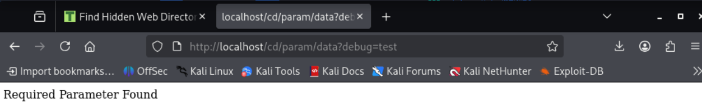

Sivussa näkyy "Required Parameter Found" eli löysin oikea parametri ja se toimii.

# h) Rate Limited

Tässä on Rate Limited eli palvelin rajoittaa pyyntöjen määrää. jos ffuf menee liian nopasti, voi tulla virheitä tai tulokset eivät ole luotettavia. 

Ensimmäiseksi testasin ilman rajoituksia komennolla:

 `ffuf -w ~/Downloads/common.txt -u http://localhost/cd/rate/FUZZ`

 Tässä:

 - `-w` = wordlist
 - `-u` = kohde URL
 - `FUZZ` = kohta johon sanat menee

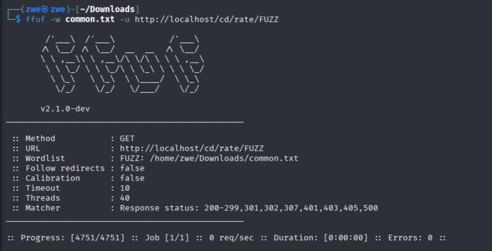

Ei näkynyt mitään tuloksia. Tämä johtuu siitä, että palvelin estää tai rajoittaa liian nopeat pyynnöt.

Seuraavaksi käytän komentoa:

 `ffuf -w ~/Downloads/common.txt -u http://localhost/cd/rate/FUZZ -rate 5`.

 Tässä `-rate 5` = max 5 pyyntoä sekunnissa

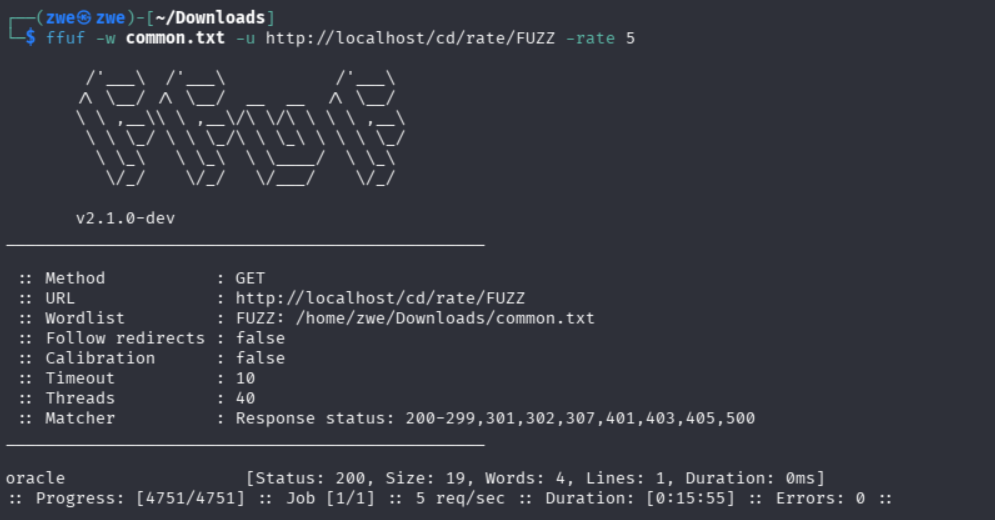

Näkyy nyt tuloksena "oracle" eli löydetty endpoint. Testasin selaimessa:

`http://localhost/cd/rate/oracle`

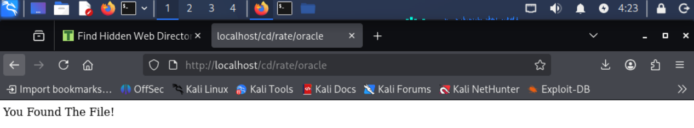

Lukee "You Found The File!" eli löysin oikea endpoint.

# i) Subdomains - Virtual Host Enumeration

Etsitään nyt virutaalisia hosteja eli ei mitään `/admin` tyyppisiä polkuja, vaan enemmän tyyliin:

`admin.localhost`
`test.localhost`

Minulla ei ollut `subdomains.txt`, joten latasin sen komennolla:

`wget http://ffuf.me/wordlist/subdomains.txt`

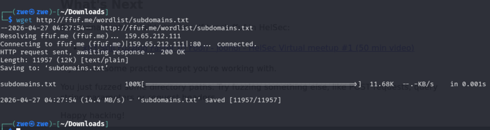

Nyt on ladattu subdomains.txt niin seuraavaksi suoritetaan suoritin: 

`ffuf -w subdomains.txt -u http://localhost -H "Host: FUZZ.localhost"`.

Tässä:
- `-w` = wordlist(subdomainit)
- `-u` = kohde URL
- `-H "Host: FUZZ.localhost"` = ffuf muuttaa Host-headeria ja testaa eri subdomainit

Eli ffuf testaa esimerkiksi:

`admin.localhost`
`admin.localhost`
`test.localhost`

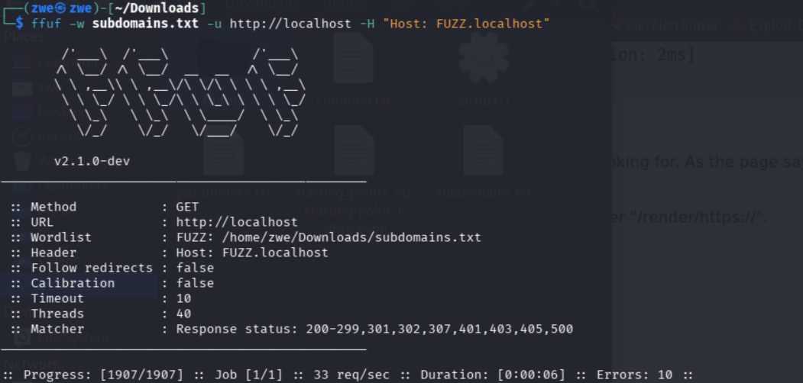

Tästä ei kuitenkaan tullut oikeita tuloksia ja tuli myös error 10 kappaletta, joten vaihdoin lähestymistapaa.

Käytin komentoa:

`ffuf -w subdomains.txt -u http://localhost -H "Host: FUZZ.ffuf.me"`

vaihdoin domainin `ffuf.me`:ksi, koska localhostilla ei löytynyt mitään. Tämä harjoitus toimii niin, että oikeat virtual hostit löytyy ffuf.me domainin kautta. Pelkkä `localhost` ei tässä vaiheessa palauttanut oikeita tuloksia.

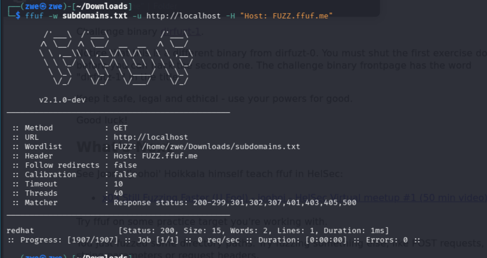

Sain tuloksena:

`redhat` 

Eli oikea virtuaalinen hosti on:

`redhat.ffuf.me`

Koska tämä domain ei oikeasti ole DNS:ssä, selain ei tiedä mihin osoitteeseen `redhat.ffuf.me` pitäisi ohjata. Eli jos yrittäisin avata sen suoraan, se ei toimisi.

Tämän takia domain pitää lisätä paikallisesti omaan koneeseen, jotta se osoittaa `localhost`:iin eli omaan koneeseen.

Avasin hosts-tiedoston:

 `sudo nano /etc/hosts`

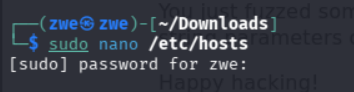

Lisäsin rivin:

`127.0.0.1 redhat.ffuf.me`

ja tallennetaan painamalla:
- CTRL + O -> Enter
- sitten CTRL X

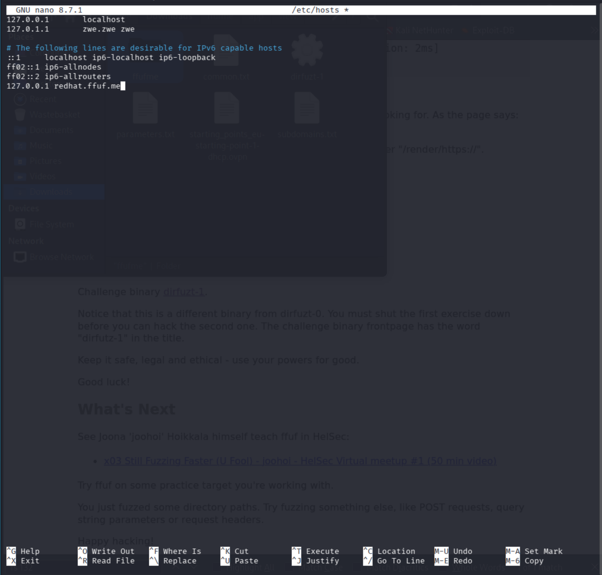

Sitten menin selaimeen kirjoittaa:

`http://redhat.ffuf.me` 

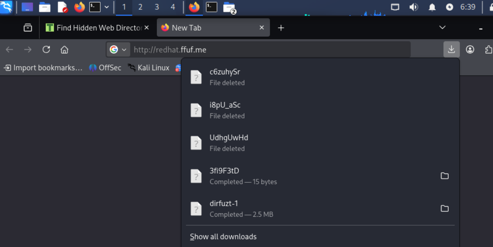

Selain latasi tiedoston, mikä on tässä tapauksessa normaalia.

Testasin vielä vamemmin komennolla: 

`curl -H "Host: redhat.ffuf.me" http://localhost`

Tässä:
- `curl` = tekee HTTP-pyynnön terminaalista
- `-H` = lisää HTTP-headerin
- `"Host: redhat.ffuf.me"` = määrittää Host-headerin arvon
- `http://localhost` = pyyntö menee omalla koneelle

Tällä komennolla pakotan pyynnän näyttämään tältä:

`Host: redhat.ffuf.me`

- `localhost` -> näyttää normaalin sivun
- `redhat.ffuf.me` -> näyttää eri sisällön

ja näkyy seuraavasti:

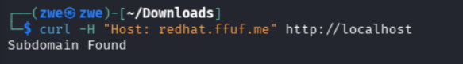

Eli se palautti `Subdomain Found` eli löysin oikean virtual hostin onnistuneesti.

Lähteet:

- Karvinen, T. 2023. Fuffme - Install Web Fuzzing Target on Debian. Luettavissa: https://terokarvinen.com/2023/fuffme-web-fuzzing-target-debian/

- Karvinen, T. 2023. Find Hidden Web Directories - Fuzz URLs with ffuf. Luettavissa: https://terokarvinen.com/2023/fuzz-urls-find-hidden-directories/

- GitHub. ffuf - README.md. Luettavissa: https://github.com/ffuf/ffuf/blob/master/README.md

- ffuf. Luettavissa: https://github.com/ffuf/ffuf
