# x)  Lue/katso ja tiivistä. 
## Karvinen 2022: [Cracking Passwords with Hashcat](https://terokarvinen.com/2022/cracking-passwords-with-hashcat/)

- Artikkelissa sanotaan, että salasanoja ei talleneta suoraan, vaan niiden hash-arvo, jotka voidaan murtaa Hashcat-ohjelmalla ja sanalistalla.
- Artikkelissa käytetään "rockyou.txt"-sanalistaa, joka sisältää miljoonia yleisiä salasanoja.
- Ennen murtamista sinun on tunnistettava hashin tyyppi (esim. MD5), jotta Hashcat toimii oikein.
- Ennen murtaamist
- Hashcat vertaa hashia sanalistaan ja voi löytää alkuperäisen salasanan, jos se on listassa(esim. "summer").
- Työkalu toimii nopeammin tehokkaalla koneella, ja siitä tulisi käyttää vain luvalla.
- En tiennyt yksinkertaiset salasanojen murtaamista on näin helppoa.

## Karvinen 2023: [Crack File Password With John](https://terokarvinen.com/2023/crack-file-password-with-john/)

- Tässä artikelissa kerrotaan, kuinka salasanasuojattu ZIP-tiedosto voidaan murtaa John the Ripper -työkalun avulla.
- Tiedostoa ei voi avata ilman salasanaa, joten ensin pitää poimia hash työkalulla "zip2john".
- Ajetaan John the Ripper ja se tekee sanakirjahyökkäystä ja kokeilee eri salasanoja saatua hashin vastaan.
- Jos salasana löytyy listasta, ohjelma paljastaa sen salasana.
- Kun salasana on selvitetty, tiedosto voidaan avata ja saa daan sisältöä käyttöön.

# a) Asenna Hashcat ja testaa sen toiminta murtamalla esimerkkisalasana.

Avataan ensimmäiseksi Kali-kone. Kali-koneessa on esiasennettuna Hashcat, joten tällä kertaa sitä ei tarvitse ladata erikseen. 

Avataan terminaali ja tehdään joku random salasana. Täällä kertaa valitsin salasanaksi "hacker". 

Sitten tein siitä hashin käyttämällä:

`echo -n "hacker" | md5sum`

Tässä:

`echo` -> tulostaa 

`-n` -> ei lisää rivinvaihdon loppuun

`hacker` ->itse salasana

`|` -> siirtää seuraavalle komennolle

`md5sum` -> tekee salasana tekstistä "hashin"

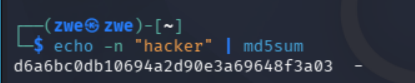

Siitä sain hashin `d6a6bc0db10694a2d90e3a69648f3a03` ja nyt tallennetaan se tekstitiedostoon komennolla:

`echo "d6a6bc0db10694a2d90e3a69648f3a03" > hash.txt`

Tässä:

`>` -> ohjaa tiedostoon

`hash.txt` -> tiedoston nimi

Nyt on luotu hash.txt, ja seuraavaksi tehdään sanalistatiedosto, joka käy salasanoja läpi.

Täällä kertaa valitsin neljä random sanaa ja yhden oikean sanan eli "hacker", ja teen tästä tiedoston "words.txt". 

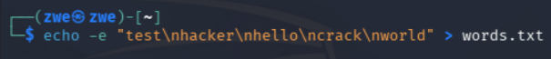

Nyt loppuu valmistautuminen ja ajetaan Hashcat! Sen komento on:

`hashcat -m 0 -a 0 hash.txt words.txt`. 

Tässä on:

`-m 0` -> hash-tyyppi eli tässä MD5

`-a 0` -> hyökkäystapa ja tässä sanakirjahyökkäys

`hash.txt` -> tiedosto, jossa on hash

`words.txt` -> sanakirja, joka kokeillaan tässä

Sen tuloksena sain:

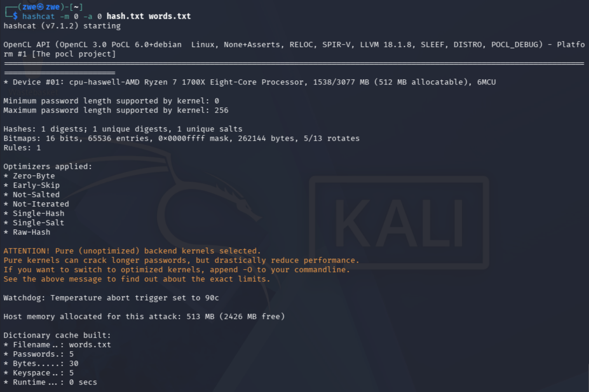

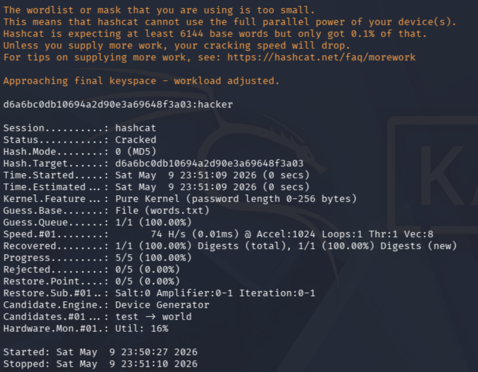

Sen suoritus meni hyvin ja nyt tarkistetaan seuraavan komennon avulla Hashcatissa salasana 

`hashcat --show -m 0 hash.txt` 

ja sain tuloksena: 

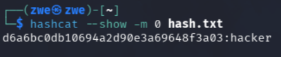

Eli siinä näkyy salasana ja salsanan murto onnistui! tietysti oikeassa tilanteessa tämä ei ole näin helppoa, mutta nyt ainakin käytiin perustoiminnot ja nätiin, miten homma toimii

# c) Asenna John the Ripper ja testaa sen toiminta murtamalla jonkin esimerkkitiedoston salasana.

Tässä käytetään John the Ripper -työkälua, ja se on myös valmiiksi asennettu Kali-koneessa. 

Nyt tehdään uusi tiedosto, jonka nimi on "secret.txt" ja sen komento on:

`echo "salainen tieto" > secret.txt `

Tässä:

`echo` -> näyttää teksti

`salainen tieto` -> teksti mitä laitetaan

`>` -> tallentaa tiedostoon

`secret.txt` -> tiedoston nimi

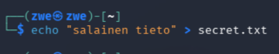

Sen jälkeen tehty tiedosto pakataan zip-tiedostoon, ja komento on:

`zip --encrypt secret.zip secret.txt` 

ja määritellään salasana. 

Tässä:

`zip` -> pakkaa tiedosto zip-muotoon

`--enncrypt` -> lisää salasanasuojaus

`secret.zip` -> zip-tiedoston nimi

`secret.txt` -> tiedosto, joka pakataan

Tällä kertaa salasana on "Hacker".

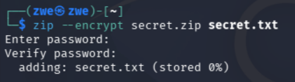

Sen jälkeen käytetään John-työkalua ja muutetaan zip-tiedosto hash-tekstitiedostoksi. Komento on : `zip2john secret.zip > hash.txt`

Tässä:

`zip2john` -> ottaa zip-tiedostoa hashin salasanan murtamista varten

`secret.zip` -> zip-tiedosto, josta otetaan hashia

`>` -> tallentaa 

`hash.txt` -> tiedosto, johon hash tallennetaan

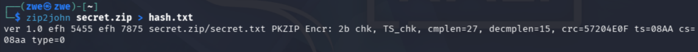

Tehdään uudestaan sanalista, koska täällä kertaa salasana on "Hacker", ei "hacker". 

Nyt tehdään zip-tiedoston salasanan murto. Komento on:

`john --wordlist=words1.txt hash.txt`.

Tässä:

`john` -> työkalu hashien tai salasanojen murtamiseen

`--wordlist=words1.txt` -> käyttää tätä sanalistaa

`hash.txt` -> tiedosto, jossa on hash

Sain tuloksena: 

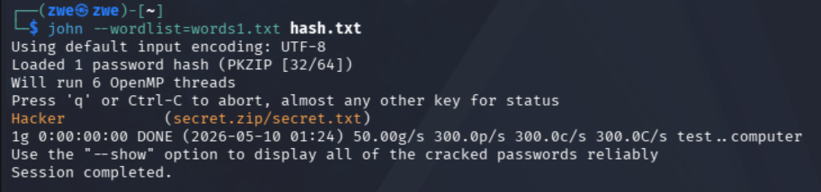

Nyt onnistui ja tarkistetaan saatu salasana komennolla:

 `john --show hash.txt`

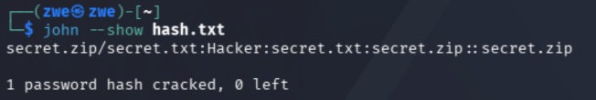

Nyt saatiin "Hacker", eli murto onnistui! 

Varmistin vielä, että salasana toimii oikeasti, ja sain zip-tiedoston purettua onnistuneesti!

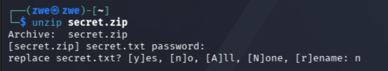

# e) Tiedosto. Tee itse tai etsi verkosta jokin salakirjoitettu tiedosto, jonka saat auki. Murra sen salaus.

Tässä käytin salattua PDF-tiedostoa ja sen murtaamista John the ripperin avulla.

Ekan asensin kaksi tarvittavaa sovellusta, ja ne ovat "pandoc" ja "qpdf". Asennuskomennot ovat:

`sudo apt install pandoc`
`sudo apt install qpdf`

 pandoc muuntaa tekstitiedoston PDF-muotoon. 
 
 qpdf mahdollistaa PDF-tiedoston suojaamisen salasanalla.

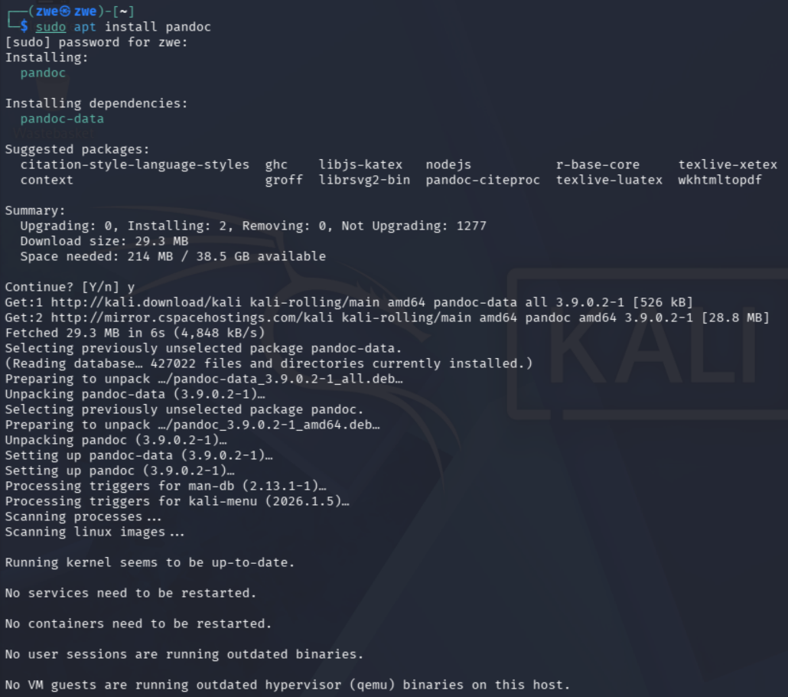

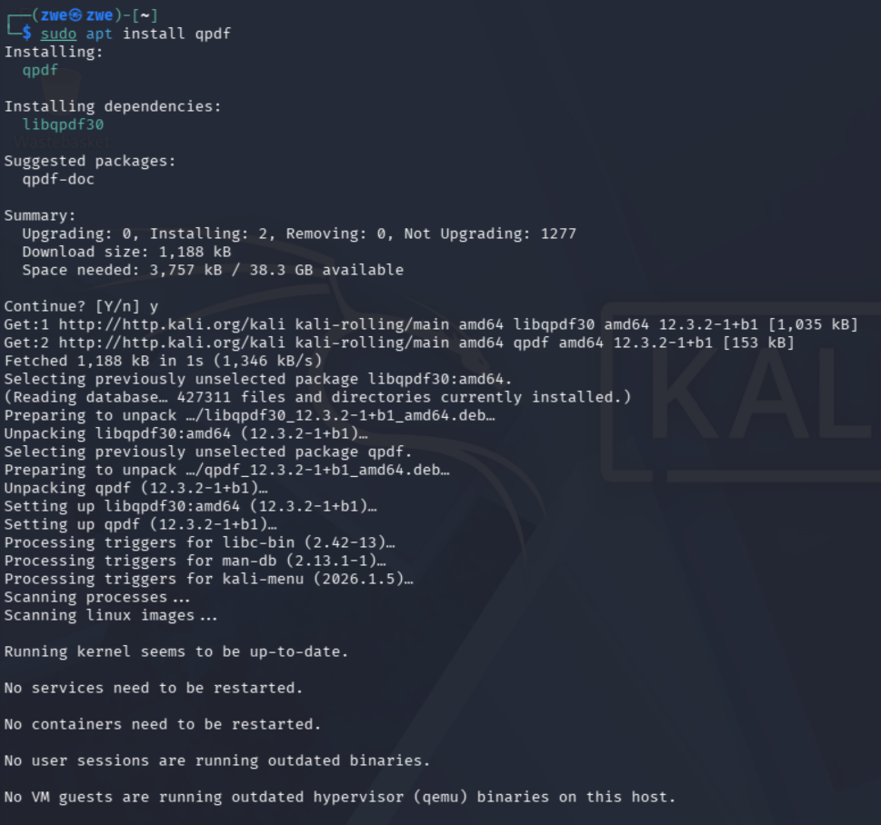

Tämän jälkeen tehdään taas uusi tiedosto komennolla:

`echo "salainen pdf" > file.txt` 

Sen jälkeen Pandocia käyttämällä muutetaan tiedosto PDF-muotoon. 
Komento on:

`pandoc file.txt -o file.pdf`

Tässä:

`pandoc` -> työkalu tiedostojen muuntamisee
n
`file.txt` -> alkuperäinen tiedosto

`-o` -> määrittää mihin tiedostoon lopputulos menee

`file.pdf` -> lopputulos ja se on pdf-tiedosto

Nyt asetetaan salasana qpdf:lla tiedostolle file.pdf. Komento on:

`qpdf --encrypt hacker hacker 256 -- file.pdf protected.pdf`

Tässä:

`qpdf` -> työkalu PDF-tiedostojen suojaukseen

`--encrypt` -> ottaa käyttöön salauksen

`hacker hacker` -> salasanat(tässä on user + ownerin salasana)

`256` -> salauksen vahvuus eli 256-bit

`--` erottaa asetukset ja tiedostonimet

`file.pdf` -> alkuperäinen pdf

`protected.pdf` -> lopputulos eli salattu pdf

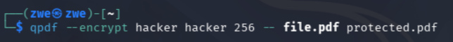

Nyt muutetaan protected.pdf hashiksi käyttämällä:

`pdf2john protected.pdf > hash1.txt`

Tässä:

`pdf2john` -> ottaa PDF-tiedostosta hashin

`protected.pdf` -> PDF, josta hash otetaan

`>` -> tallentaa tiedostoon

`hash1.txt` -> tiedosto, johon hash tallennetaan

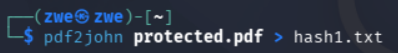

Nyt murretaan salasana käyttämällä Johnia. Tässä käytetään samaa sanalistaa kuin edellisessa tehtävässä, koska käytin samaa salasanaa. Komento on:

`john --wordlist=words.txt hash1.txt`

Tässä:

`john` -> työkalu salasanojen murtamiseen

`--wordlist=words.txt` -> käyttää tätä sanalistaa

`hash1.txt` -> tiedosto, jossa on hash

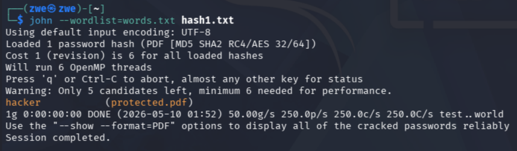

Nyt sain tehtyä, ja tarkistetaan tulos komennolla:

`john --show hash1.txt`.

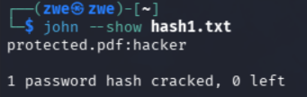

Nyt sain murtauduttu ja saatiin oikein salasana! 

Oikeassa tilanteessa PDF-salasanat voivat olla paljon vaikeampia murtaa kuin tässä demossa.

# f) Tiiviste. Tee itse tai etsi verkosta salasanan tiiviste, jonka saat auki. Murra sen salaus.

# g) Sanakirja. Oman sanakirjan teko parantaa onnistumismahdollisuuksia. Demonstroi, kuinka teet oman sanakirjan hashcat:n tai john:iin.

# h) Hash rules. Näytä esimerkki HashCatin sääntöjen käytöstä (rules).

# i) Lippuvalmistelu. Valmistele kone ensi viikon lipunryöstöön. 

## Lähteet:
